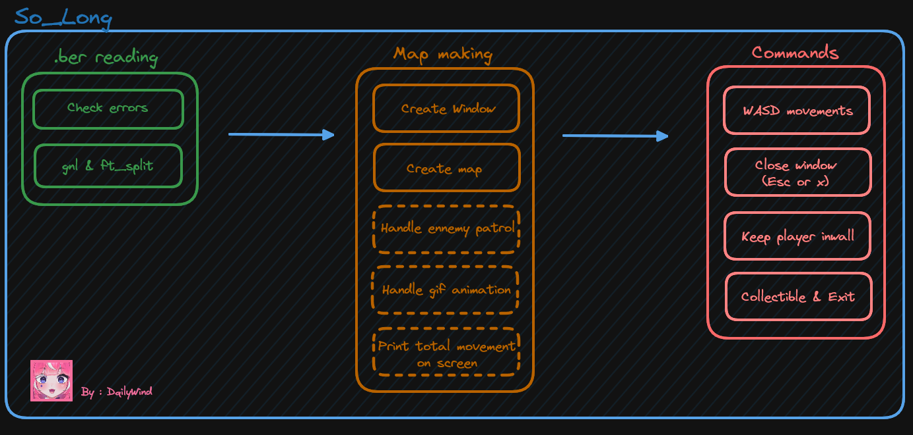

# so_long ✅105/100
Small 2D game

- 

Check also my itch.io profile :
- [itch.io](https://dailywind.itch.io/)


I used the MLX 42 for this project as it was authorized in my campus :
- [Link to the MLX42 github](https://github.com/codam-coding-college/MLX42)
- 
The MLX 42 naturally have leaks, you can suppress them with the following command when using valgrind
```shell
valgrind --suppressions="mlx42.supp" ./so_long <MAP PATH>
```


The program is divided in 3 parts :
- Map checking (*.ber)
- Map making
- Commands & Events

  

  To use the program, you must do these commands :
```shell
cd so_long
make

# Program :
./so_long <MAP PATH>
```

You also have these commands for cleaning the so_long directory :
```shell
# Clean all object files (*.o)
make clean

# Clean executable & object files
make fclean

# Clean everything and recompile the executable
make re
```
